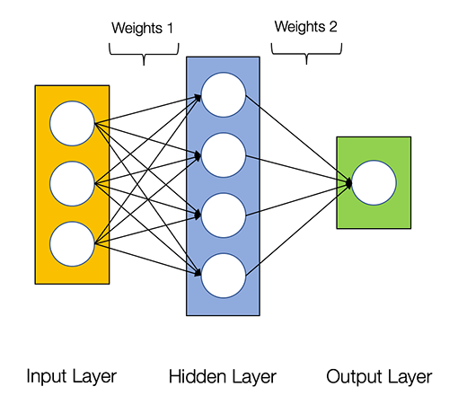

# Artificial Neural Networks with PyTorch

Welcome to this repository on **Artificial Neural Networks (ANNs)** using **PyTorch**. This project is a hands-on introduction to neural networks, progressing from fundamental concepts to practical implementations and real-world applications.

The repository is organized as a series of notebooks, each focusing on a different aspect of building and training neural networks.

---

# Repository Roadmap

## Notebook 1 — ANN Fundamentals with PyTorch

<p align="center">
  
</p>

### Overview

This notebook introduces the core concepts behind artificial neural networks and demonstrates how to implement them using PyTorch. Starting from the mathematical intuition of neural networks, it covers forward propagation, gradient descent, automatic differentiation, and binary classification.

**Topics Covered**

* Artificial neurons
* Perceptrons
* Activation functions
* Feedforward neural networks
* Forward propagation
* Binary Cross-Entropy Loss
* Gradient Descent
* Backpropagation
* PyTorch tensors
* Automatic differentiation (Autograd)
* Binary classification
* Iris dataset
* GPU acceleration (CUDA)

**Notebook**

```text
01_ann_fundamentals_pytorch.ipynb
```

---

## Notebook 2 — Multiclass Neural Networks

<!-- Add notebook image here -->

### Overview

This notebook extends the concepts introduced in Notebook 1 to multiclass classification problems. It explores softmax outputs, multiclass loss functions, and the implementation of deeper neural network architectures using PyTorch.

**Topics Covered**

* Softmax activation
* Multiclass Cross-Entropy Loss
* Multiclass classification
* Neural network training
* Performance evaluation

**Notebook**

```text
02_multiclass_neural_networks.ipynb
```

---

## Notebook 3 — Neural Network Applications

<!-- Add notebook image here -->

### Overview

This notebook demonstrates an end-to-end neural network workflow on a practical dataset, including data preprocessing, model training, evaluation, and visualization of results.

**Topics Covered**

* End-to-end deep learning workflow
* Dataset preprocessing
* Model training
* Evaluation metrics
* Model performance visualization

**Notebook**

```text
03_neural_network_applications.ipynb
```

---

# Technologies

* Python
* PyTorch
* NumPy
* Matplotlib
* Scikit-learn
* Jupyter Notebook

---

# Skills Demonstrated

* Deep Learning
* Artificial Neural Networks
* PyTorch
* Machine Learning
* Binary Classification
* Multiclass Classification
* Gradient Descent
* Backpropagation
* Automatic Differentiation
* Model Evaluation

---

# Getting Started

Clone the repository:

```bash
git clone https://github.com/Miladsaeedi70/artificial-neural-networks-pytorch.git
```

Install the required packages:

```bash
pip install -r requirements.txt
```

Launch Jupyter Notebook:

```bash
jupyter notebook
```

Start with **Notebook 1** and continue through the notebooks in numerical order.

---

# Repository Structure

```text
artificial-neural-networks-pytorch/
│
├── notebooks/
│   ├── 01_ann_fundamentals_pytorch.ipynb
│   ├── 02_multiclass_neural_networks.ipynb
│   └── 03_neural_network_applications.ipynb
│
├── images/
│   ├── ann_fundamentals.png
│   ├── multiclass_classification.png
│   └── neural_network_applications.png
│
├── README.md
├── requirements.txt
├── LICENSE
└── .gitignore
```

---

# Future Enhancements

* Convolutional Neural Networks (CNNs)
* Hyperparameter optimization
* Regularization techniques
* Model checkpointing
* Additional benchmark datasets

---

# References

* PyTorch Documentation
* Scikit-learn Documentation
* Fisher's Iris Dataset

---

# License

This project is licensed under the MIT License.
